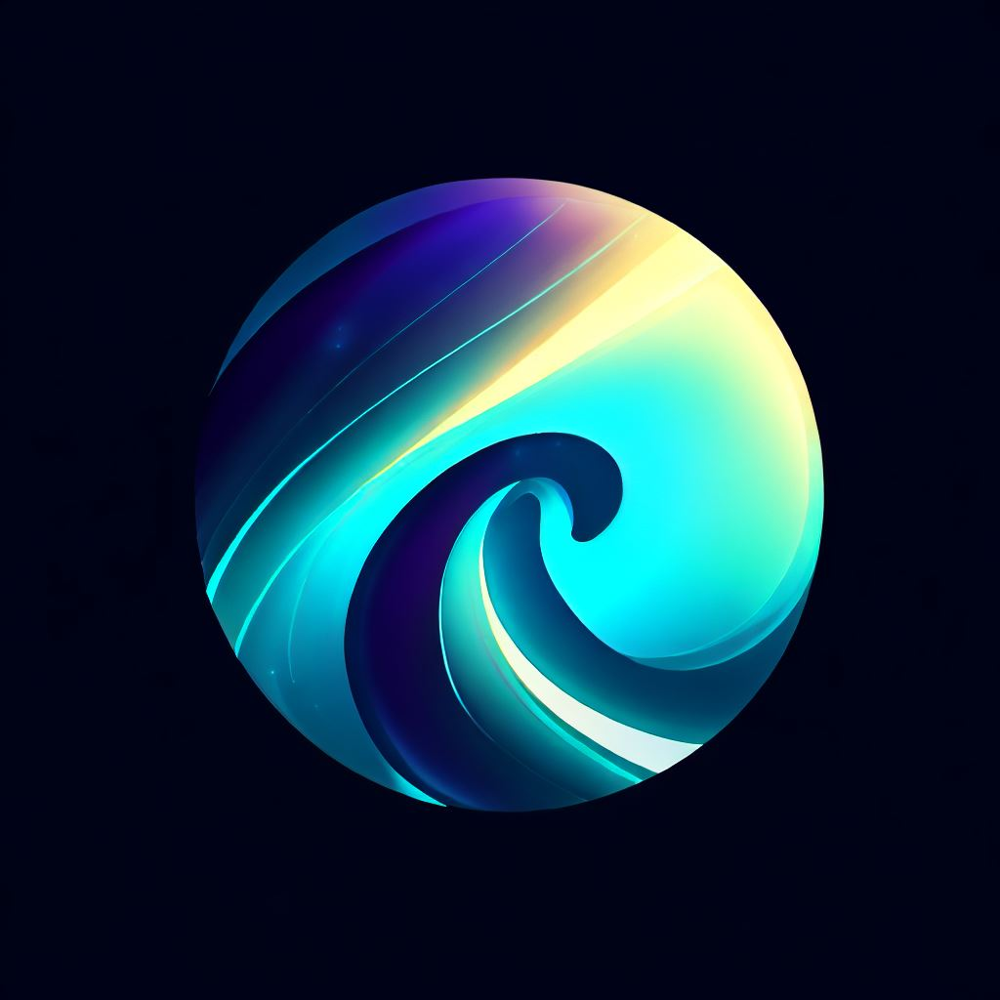

<!-- Improved compatibility of back to top link: See: https://github.com/othneildrew/Best-README-Template/pull/73 -->

<!--
*** Thanks for checking out the Best-README-Template. If you have a suggestion
*** that would make this better, please fork the repo and create a pull request
*** or simply open an issue with the tag "enhancement".
*** Don't forget to give the project a star!
*** Thanks again! Now go create something AMAZING! :D
-->

<!-- PROJECT SHIELDS -->
<!--
*** I'm using markdown "reference style" links for readability.
*** Reference links are enclosed in brackets [ ] instead of parentheses ( ).
*** See the bottom of this document for the declaration of the reference variables
*** for contributors-url, forks-url, etc. This is an optional, concise syntax you may use.
*** https://www.markdownguide.org/basic-syntax/#reference-style-links
-->

[![Contributors][contributors-shield]][contributors-url]
[![Forks][forks-shield]][forks-url]
[![Stargazers][stars-shield]][stars-url]
[![Issues][issues-shield]][issues-url]
[![MIT License][license-shield]][license-url]

<!-- PROJECT LOGO -->
 

  

<h3 align="center">project_title</h3>

  

    project_description
     
    <a href="https://github.com/lordshashank/SatStream"><strong>Explore the docs »</strong></a>
     
     
    <a href="https://github.com/lordshashank/SatStream">View Demo</a>
    ·
    <a href="https://github.com/lordshashank/SatStream/issues">Report Bug</a>
    ·
    <a href="https://github.com/lordshashank/SatStream/issues">Request Feature</a>
  

<!-- TABLE OF CONTENTS -->

  
Table of Contents

  <ol>
    <li>
      <a href="#about-the-project">About The Project</a>
      <ul>
        <li><a href="#built-with">Built With</a></li>
      </ul>
    </li>
    <li><a href="#usage">Usage</a></li>
    <li><a href="#contributing">Contributing</a></li>
    <li><a href="#license">License</a></li>
    <li><a href="#contact">Contact</a></li>
    <li><a href="#acknowledgments">Acknowledgments</a></li>
  </ol>

<!-- ABOUT THE PROJECT -->

## About The Project

SatStream is a decentralized video streaming platform that allows users to upload, store, and stream videos. It is built on top of the Filecoin and saturn network and uses the Lighthouse storage protocol as aggregator for retaining the videos on filecoin network as per user requirements.
We used tableland as database for storing video metadata and other user information. Using various stacks helped us made completely decentralized video streaming platform.

(<a href="#readme-top">back to top</a>)

### Built With

- [![Next][next.js]][next-url]
- [![React][react.js]][react-url]
- [Filecoin]
- [Lighthouse]
- [Tableland]
- [Saturn]

(<a href="#readme-top">back to top</a>)

<!-- USAGE EXAMPLES -->

## Usage

SatStream is an aim to decentralize the video streaming platform. We aim build it as alternative for people who don't want to trust the centralized platforms taking decision on their data and having access to it. We aim to build a platform where users can upload their videos and have complete control over it.

(<a href="#readme-top">back to top</a>)

<!-- CONTRIBUTING -->

## Contributing

Contributions are what make the open source community such an amazing place to learn, inspire, and create. Any contributions you make are **greatly appreciated**.

If you have a suggestion that would make this better, please fork the repo and create a pull request. You can also simply open an issue with the tag "enhancement".
Don't forget to give the project a star! Thanks again!

1. Fork the Project
2. Create your Feature Branch (`git checkout -b feature/AmazingFeature`)
3. Commit your Changes (`git commit -m 'Add some AmazingFeature'`)
4. Push to the Branch (`git push origin feature/AmazingFeature`)
5. Open a Pull Request

(<a href="#readme-top">back to top</a>)

<!-- LICENSE -->

## License

Distributed under the MIT License. See `LICENSE.txt` for more information.

(<a href="#readme-top">back to top</a>)

<!-- CONTACT -->

## Contact

Shashank Trivedi - [@lordshashank](https://twitter.com/0xLord_forever)

Project Link: [https://github.com/lordshashank/SatStream](https://github.com/lordshashank/SatStream)

(<a href="#readme-top">back to top</a>)

<!-- ACKNOWLEDGMENTS -->

## Acknowledgments

Thanks to all the sponsors and organizers for making this Open Data hackathon possible.
Mentors have been helping us, giving reviews with various aspects of the project and we are grateful to them for that.

(<a href="#readme-top">back to top</a>)

<!-- MARKDOWN LINKS & IMAGES -->
<!-- https://www.markdownguide.org/basic-syntax/#reference-style-links -->

[contributors-shield]: https://img.shields.io/github/contributors/lordshashank/SatStream.svg?style=for-the-badge
[contributors-url]: https://github.com/lordshashank/SatStream/graphs/contributors
[forks-shield]: https://img.shields.io/github/forks/lordshashank/SatStream.svg?style=for-the-badge
[forks-url]: https://github.com/lordshashank/SatStream/network/members
[stars-shield]: https://img.shields.io/github/stars/lordshashank/SatStream.svg?style=for-the-badge
[stars-url]: https://github.com/lordshashank/SatStream/stargazers
[issues-shield]: https://img.shields.io/github/issues/lordshashank/SatStream.svg?style=for-the-badge
[issues-url]: https://github.com/lordshashank/SatStream/issues
[license-shield]: https://img.shields.io/github/license/lordshashank/SatStream.svg?style=for-the-badge
[license-url]: https://github.com/lordshashank/SatStream/blob/master/LICENSE.txt
[linkedin-shield]: https://img.shields.io/badge/-LinkedIn-black.svg?style=for-the-badge&logo=linkedin&colorB=555
[linkedin-url]: https://linkedin.com/in/linkedin_username
[product-screenshot]: images/screenshot.png
[next.js]: https://img.shields.io/badge/next.js-000000?style=for-the-badge&logo=nextdotjs&logoColor=white
[next-url]: https://nextjs.org/
[react.js]: https://img.shields.io/badge/React-20232A?style=for-the-badge&logo=react&logoColor=61DAFB
[react-url]: https://reactjs.org/
[vue.js]: https://img.shields.io/badge/Vue.js-35495E?style=for-the-badge&logo=vuedotjs&logoColor=4FC08D
[vue-url]: https://vuejs.org/
[angular.io]: https://img.shields.io/badge/Angular-DD0031?style=for-the-badge&logo=angular&logoColor=white
[angular-url]: https://angular.io/
[svelte.dev]: https://img.shields.io/badge/Svelte-4A4A55?style=for-the-badge&logo=svelte&logoColor=FF3E00
[svelte-url]: https://svelte.dev/
[laravel.com]: https://img.shields.io/badge/Laravel-FF2D20?style=for-the-badge&logo=laravel&logoColor=white
[laravel-url]: https://laravel.com
[bootstrap.com]: https://img.shields.io/badge/Bootstrap-563D7C?style=for-the-badge&logo=bootstrap&logoColor=white
[bootstrap-url]: https://getbootstrap.com
[jquery.com]: https://img.shields.io/badge/jQuery-0769AD?style=for-the-badge&logo=jquery&logoColor=white
[jquery-url]: https://jquery.com
[Filecoin]: https://filecoin.io/
[Lighthouse]: https://www.lighthouse.storage/
[Tableland]: https://tableland.xyz/
[Push-Protocol]: https://push.org/
[Beryx]: https://www.brex.com/product/api
[Saturn]: https://saturn.tech/
